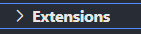
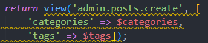

# Avviare automaticamente terminali globalmente o all'apertura di una specifica repository, (e in fondo) eliminare le sottolineature di VSCode fastidiose.

### Introduzione

---

Siete stanchi ogni volta che aprite una repository di aprire 10 terminali e lanciare 20 comandi e perdere preziosi minuti di studio / lavoro? Da oggi non sarà più così grazie a questa guida!

### Procedura

---

1. Innanzitutto occorre scaricare questa estensione [Restore Terminals](https://marketplace.visualstudio.com/items?itemName=EthanSK.restore-terminals "EthanSK.restore-terminals") scaricabile direttamente dall'Extension Marketplace dentro VSCode.
   
2. Adesso la procedura si sdoppia in base a avete bisogno di avviare dei terminali che eseguono azioni ad ogni repo che aprite, oppure solo a specifiche repository.
3. Aggiornamento: ho ancora testato poco ma sembra che le due procedure non siano compatibili. Se installate globalmente dovrebbe sovrascrivere l'installazione per singole repo.

### Installazione globale

---

1. Bisogna accedere alle impostazioni del file settings.json presente nella cartella **User**, per chiarirci:

   Esistono tanti modi per arrivarci. Questa è la procedura lunga e noiosa. Se hai fretta segui la procedura più veloce descritta al punto 2 della prima indentazione.

   - Cliccare sulla rotella in basso ed andare nelle impostazioni:
     
   - Usare lo shortcut della tastiera. Di default è *Ctrl + ,*
   - Dalla scheda in alto *File > Preferences > Settings*

   

   * Sulla colonna di sinistra trovare la voce in fondo *Extensions*

   

   - Cercare l'estensione *Restore Terminals Config*

   

   - É possibile anche cercare direttamente nella barra di ricerca in alto "*Restore Terminals*"

   * Entrati nelle impostazioni dell'estensione ci apparirà tra le prime impostazioni "*Edit in setting.Json*" e cliccandoci comparirà il file ***settings.json***

   
2. Un metodo molto più veloce è aprire la tab di ricerca con *Ctrl + Shift + P* e scrivere "***settings.json***" e selezionare "*Open User **Settings** **(JSON)***"


3. All'interno del file di configurazione troverai in fondo questa proprietà:

   
4. Puoi tenerla, ma io ti consiglio di eliminarla e sostituirla con il prossimo blocco di codice testuale che dovrai incollarci al posto suo. Presta attenzione a non eliminare l'ultima parentesi graffa che chiude il file .json
5. Il blocco che segue è già impostato per creare 4 terminali per:

   * avviare il Server PHP
   * avviare il Laramix Watch
   * visualizzare tutte le CRUD routes' list
   * un terminale vuoto dove potrai scrivere i comandi che ti servono.
6. ***Copia e incolla questo blocco***:

```json
    "restoreTerminals.runOnStartup": true, // Impostando questo comando di sotto su true si avvieranno questi terminali sotto all'avvio di questa repo.
    "restoreTerminals.terminals": [
        {
            "splitTerminals": [
                {
                    "name": "Crud Route List",
                    "commands": [
                        "php artisan route:list --columns=method,uri,name,action"
                    ]
                }
            ]
        },
        {
            "splitTerminals": [
                {
                    "name": "Server",
                    "commands": [
                        "php -S localhost:8000 -t public"
                    ]
                }
            ]
        },
        {
            "splitTerminals": [
                {
                    "name": "Laramix Watch",
                    "commands": [
                        "npm run watch"
                    ]
                }
            ]
        },
        {
            "splitTerminals": [
                {
                    "name": "Terminal", // Terminale dove scriverai
                }
            ]
        },
    ]


```

7. Salva. Adesso ogni volta che aprirai qualsiasi repo partiranno questi 4 terminali che avvieranno i comandi scritti.
8. Per personalizzare i terminali:

   * di fianco a "*name*" scrivi tra virgolette il nome del tuo terminale che comparirà nella barra in alto del terminale, esempio:

     
   * in commands verranno lanciati in successione i comandi da scrivere in quel terminale. Puoi lanciarne solo uno mettendolo tra doppi apici, oppure lanciare in successione più comandi scrivendoli in un array e separando i comandi da virgole. Esempi:
9. Esistono altri comandi ma questi per il momento sono quelli base.

## Installazione per singola repo

Molto probabilmente vorresti aprire determinati terminali che lanciano determinati comandi diversi da ogni repo. Segui questi passaggi:

1. Nell'explorer o comunque nella cartella della repo, crea una cartella *.vscode*

   
2. É fondamentale che non sia contenuta nessun altra sotto cartella come ad esempio dentro "vendor" o "public", ma sia al loro livello dentro la cartella generale della tua repo
3. Un'accortezza potrebbe essere non pushare questa cartella su GitHub e qundi inserirla all'interno del file .gitignore

   
4. Al suo interno crea un file *settings.json*
5. All'interno crea lo stesso blocco json che ho scritto prima. Te lo riporto leggermente diverso. Essendo un file json vuoto non avrà le parentesi graffe al suo interno, e quindi le andrò a scrivere direttamente io:

   ```json
   {
       "restoreTerminals.runOnStartup": true, // Impostando questo comando di sotto su true si avvieranno questi terminali sotto all'avvio di questa repo.
       "restoreTerminals.terminals": [
           {
               "splitTerminals": [
                   {
                       "name": "Crud Route List",
                       "commands": [
                           "php artisan route:list --columns=method,uri,name,action"
                       ]
                   }
               ]
           },
           {
               "splitTerminals": [
                   {
                       "name": "Server",
                       "commands": [
                           "php -S localhost:8000 -t public"
                       ]
                   }
               ]
           },
           {
               "splitTerminals": [
                   {
                       "name": "Laramix Watch",
                       "commands": [
                           "npm run watch"
                       ]
                   }
               ]
           },
           {
               "splitTerminals": [
                   {
                       "name": "Terminal", // Terminale dove scriverai
                   }
               ]
           },
       ]
   }


   ```
6. Altri consigli potrebbero essere quelli di copiare questa cartella .vscode da qualche parte ed incollarla in qualsiasi repo tu desideri, modificando a dovere i terminali e i comandi da lanciare.

---

#### Fonti

* [https://www.youtube.com/watch?v=Qi4Vw3DcpeA](https://www.youtube.com/watch?v=Qi4Vw3DcpeA)[https://github.com/EthanSK/restore-terminals-vscode/blob/master/sample-test-project/.vscode/restore-terminals.json](https://github.com/EthanSK/restore-terminals-vscode/blob/master/sample-test-project/.vscode/restore-terminals.json)
* [https://stackoverflow.com/questions/51312095/save-terminal-tabs-to-saved-workspace-vscode](https://stackoverflow.com/questions/51312095/save-terminal-tabs-to-saved-workspace-vscode)
* [La pagina di installazione dell&#39;estensione uguale all&#39;Extension Marketplace](https://marketplace.visualstudio.com/items?itemName=EthanSK.restore-terminals)

---

---

---


# Eliminare sottolineature fastidiose


Trasforma la tua vita da così



a così


---

### Fonti:

[Video Youtube](https://www.youtube.com/watch?v=vR2y4VoCZg4)

---

### ***#nonseiunveroprogrammatoresenonconoscieusi:***

* [Espanso](https://espanso.org/)

---


---

#### Disclaimer

L'autore chiede pietà e pazienza in quanto è il primo readme.md che creo, e ho combattuto un sacco con specie con le indentazioni che sono so perchè le abbiano create così difficili da fare. 🙏🙏🙏

---
